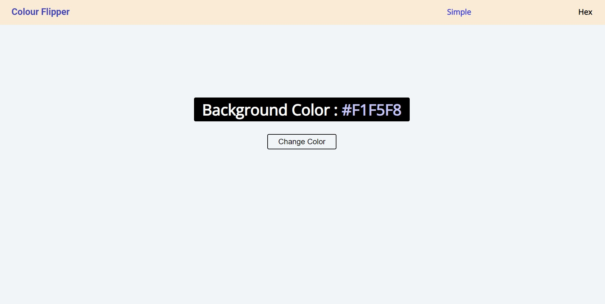

# Color Flipper

A simple color flipper web application built with HTML, CSS, and JavaScript. The Color Flipper generates random colors and allows users to change the background color by clicking a button.
This website is built using the JavaScript programming language and is hosted on the Cloudflare platform.

**Features**

- Generates random colors on button click
- Updates the background color dynamically
- Displays the generated color in hexadecimal format

 

**Languages**

**URL**

https://color-flipper-1by.pages.dev/
